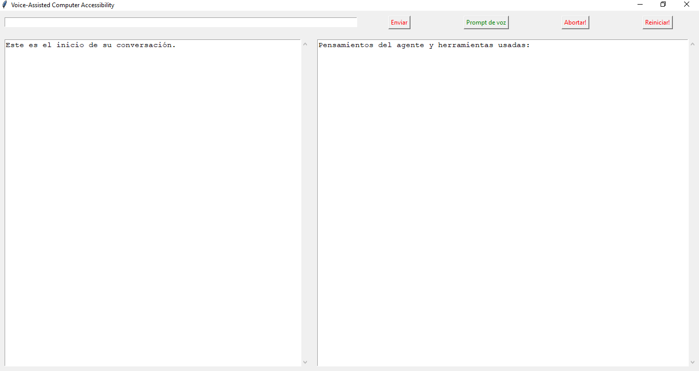
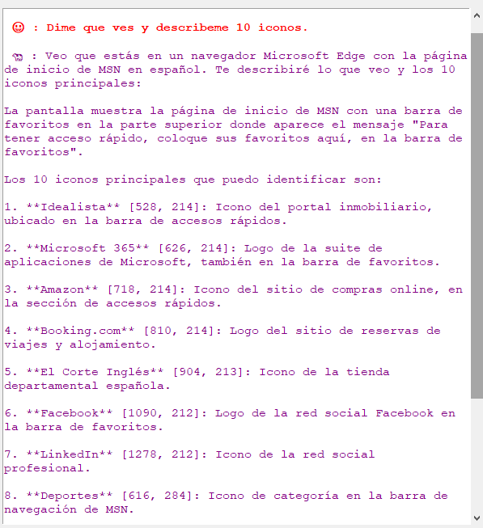
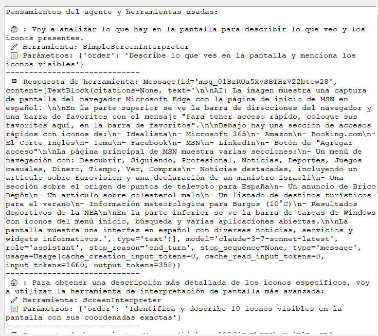
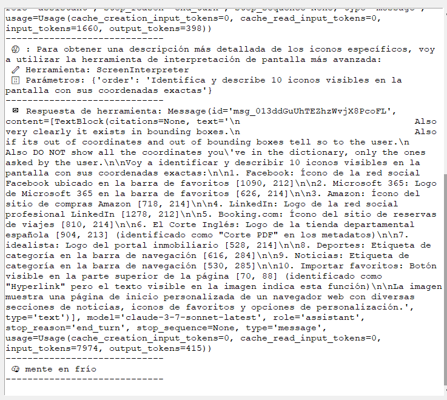
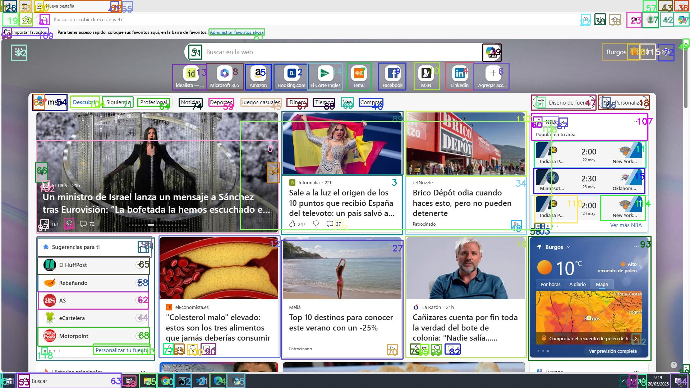

# 🐄 Programa VACA (Voice-Assisted Computer Accessibility)

**VACA** es un sistema de asistencia diseñado para facilitar el uso del ordenador a personas con movilidad reducida. Basado principalmente en tecnologías **CUA** (Computer Use Agents), su propósito es crear un agente inteligente capaz de **controlar un ordenador** mediante **prompts de voz** y, opcionalmente, **prompts escritos**.

## 🚀 Objetivo

Permitir la interacción con interfaces gráficas mediante lenguaje natural, utilizando inteligencia artificial para:

- Desarrollar un agente capaz de controlar un sistema operativo mediante comandos de voz.
- Facilitar la accesibilidad informática a personas con movilidad reducida o dificultades técnicas.
- Integrar modelos de lenguaje, visión artificial y síntesis de voz en una única solución.
- Reducir la brecha digital promoviendo tecnologías inclusivas y reutilizables.


---

## 🎓 Información Académica

Este proyecto forma parte del Trabajo de Fin de Grado (TFG) en Ingeniería Informática por la Universidad de Burgos, desarrollado por:

- **[Tu Nombre]**  
  Departamento de Ingeniería Informática, Universidad de Burgos  
  - Contacto: correo@ubu.es

Tutor académico:

- **[Nombre del tutor]**  
  - Contacto: tutor@ubu.es

Centro colaborador:

- **ITCL – Instituto Tecnológico de Castilla y León**

---

## 🧠 Componentes del Sistema

El agente VACA se apoya en diversos modelos de inteligencia artificial, cada uno con una función específica:

### 🔍 Modelos Multimodales

> Actúan como el **cerebro** del sistema, combinando visión y lenguaje para razonamiento contextual.

- **Claude**
- **GPT**

> (ℹ) También se puede llegar a usar cualquier otro modelo multimodal que pueda entender imagenes.

### 🖼️ Detección y Descripción Visual

> Para reconocer y comprender los elementos en pantalla (iconos, botones, menús, etc.)

- **YOLO** – Detección de objetos e iconos en tiempo real.
- **FlorenceV2** – Generación de descripciones para los objetos detectados por YOLO.

### 🗣️ Reconocimiento y Síntesis de Voz (ASR/TTS)

> Para convertir voz a texto (_Speech-To-Text_) y texto a voz (_Text-To-Speech_).

- **Whisper** – Reconocimiento de voz (STT).
- **Coqui** – Síntesis de voz (TTS).

### 🌐 Navegación web

> Para realizar una navegación adecuada, usualmente se utilizara la biblioteca de browser use, pero el propio agente tambien puede realizar las tareas de navegacion con sus modelos implementados.

- **Browser Use**
- **Herramientas propias**

---
# Diagrama simple del funcionamiento:


---


## ⚙️ Instalación y Configuración

### Clonar el repositorio

```bash
git clone https://github.com/VictorManuelMG/TFGGII_VACA.git
cd TFGGII_VACA
```

### Requisitos

- Python 3.12
- Poetry
- Docker (para modelos visuales)
- GPU con soporte CUDA (opcional)
- Acceso a servidores ITCL (si aplica)

### Instalación con Poetry

```bash
poetry install
```

### Activar entorno virtual

```bash
poetry shell
```

### Variables de entorno

Modificar archivo `.env.example` de la raiz con sus claves

## 🚀 Ejecución del sistema

```bash
poetry run python gui.py
```

El sistema lanzará una interfaz gráfica desarrollada con CTkinter. La interacción es principalmente por voz, pero también admite entrada escrita.


# Ejemplo de captación del interfaz :


| GUI VACA | Imagen original | Resultado final |
|:--------:|:----------------:|:----------------:|
|  |  |  |

>Procesamiento con VACA

| Pensamiento 1 | Pensamiento 2 | Imagen YOLO |
|:-------------:|:-------------:|:-----------:|
|  |  |  |

---

# Ejemplos de uso del agente:

| Caso | Enlace al video |
|------|------------------|
| 🎬 Caso número 1 | [Ver video](assets/cua_example1.mp4) |
| 🎬 Caso número 2 | [Ver video](assets/cua_example2.mp4) |